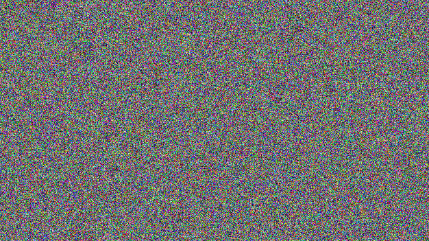

This script implements a random idea I had a year ago about adding some security to data through scrambling.

## Results
From left to right are the original image, encrypted image, and decrypted image:

<!-- Images Original, Encrypted, Decrypted -->
<p align="center">
  
  
  
</p>

## Explanation
- Given N datum, there are N! different permutations.

- [Stirling's approximation](https://en.wikipedia.org/wiki/Stirling%27s_approximation) gives an estimate for N!:
```
        N! ~= sqrt(2piN) * (N/e)^N
```

- We can solve for the value of K where N! < 2^K:
```
        N!       <  2^K
        log2(N!) <  K

        N!       ~= sqrt(2piN) * (N/e)^N
        log2(N!) ~= log2(sqrt(2piN)) + Nlog2(N/e)

        K        >  log2(sqrt(2piN)) + Nlog2(N/e)
```

- Numpy has 2^32 possible random seed values in [0, 2^32).

- Dividing K by 32 will give the number of times we must choose a random seed for the Mersenne Twister and scramble the data, such that brute forcing through the space of random seed permutations is as inefficient as brute forcing all possible permutations of the data itself.

## Runtime Improvements
As the amount of data being scrambled grows, runtime increases with O(N!).  This raises the question, how much scrambling is enough?

A modern supercomputer does 2^60 FLOPs.  There are a bit fewer than 2^65 seconds in one trillion years.  Therefore, it would take a supercomputer about one trillion years to perform 2^125 FLOPS.

Setting `scramble(..., i_k_max=125)` will cause the scrambling to iterate a number of times such that the size of the space of random seed permutations is >= 2^125.  Amazingly, this only requires four iterations.

## Use
- Decide on a password
- Flatten data to a 1-D array
- Encrypt via:
```
    na_data_enc = scramble(na_data, s_password, b_encrypt=True, i_k_max=i_k_max)
```
- Decrypt via:
```
    na_data_dec = scramble(na_data_enc, s_password, b_encrypt=False, i_k_max=i_k_max)
```
- Reshape data

## Algorithm
```
    For required number of iterations:
        Append iteration to password, and hash to a value in [0, 2^32)
        Use hash value to seed random number generator
        Shuffle indices of the data
    Apply (encrypt) or unapply (decrypt) shuffled indices
```

## Setup
Create conda environment via:
```
    conda env create -f environment.yaml
```
Run demo via:
```
python data_scrambler_demo.py
```


